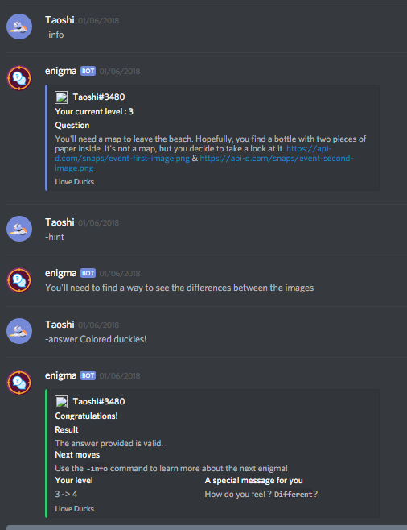

This article is a step-by-step tutorial on how to install a fork of DuckEnigma, and create some questions.
Let's start by a recap of what DuckEnigma is.
<!--more-->

## What is DuckEnigma
Duckenigma is a discord bot, created for an event on the DuckHunt server at first. It has been open-sourced on [GitHub](https://github.com/duckhunt-discord/enigma) since the end of the event, and you can now use it as a template for your own event needs.

### What does it looks like 

Here is what a typical talk with the bot looks like 

### What are the commands

Here is the command list : 

| Command                                   | Default cooldown | Description                                            |
|-------------------------------------------|------------------|--------------------------------------------------------|
| -answer [your answer]                     | 10/2min          | Try to answer your current enigma level.               |
| -hint                                     | 2/30min          | Get a random hint on your current level, if available. |
| -level                                    | 2/15s            | Show your current rank                                 |
| -info                                     | 2/15s            | Show current level information                         |
| (super admin only) -eval                  | N/A              | Eval python code                                       |
| (super admin only) -load_cog [filename]   | N/A              | Load another cog                                       |
| (super admin only) -reload_cog [filename] | N/A              | Reload a cog                                           |
| (super admin only) -unload_cog [filename] | N/A              | Unload a loaded cog                                    |
| (super admin only) -exit                  | N/A              | Exit the bot                                           |

## Installation

If you want to proceed with the bot installation, you'll need :

* A VPS or a linux (ubuntu) box to run the bot. You can get them for cheap at ScaleWay (a START1-XS will do just fine) or DigitalOcean, but you can't get them for free
* An internet connection
* A basic understanding of JSON, terminal, and discord bots
* A discord account













###  Dependencies

You'll need to download dependencies first. On a ubuntu-based linux bot, that means you should use


sudo add-apt-repository ppa:deadsnakes/ppa
sudo apt-get update
sudo apt-get install python3.6 python3.6-dev git screen
curl https://bootstrap.pypa.io/get-pip.py | sudo python3.6
pip3.6 install -U git+https://github.com/Rapptz/discord.py@rewrite#egg=discord.py[voice]


### Get the code

Change your current directory to where you want to install the bot:


cd §§installation_folder§§


Then, clone the git repo using


git clone [INSERT URL HERE] && cd enigma


### Create a discord bot account

Go to [this page](https://discordapp.com/developers/applications/me) and create a new account for the enigma bot. Don't forget to click on the create a bot user button, and to take not of the secret token. 


Before reading further, you can fill the form at the top of the page to add your bot ID and token. This will generate the config files for you, without needing to reload the page.


Your token is currently set to 

§§bot_token§§

, and your client ID is set to 

§§bot_id§§
.

### Create a credentials.json file for the bot

Use your favorite editor to create a credentials.json file in the bot root folder :


nano credentials.json


Add the following content in the file :


{
  "token": "§§bot_token§§"
}


Save and exit

### Try to start the bot (optionnal)

Type 

python3.6 ./bot.py

to run the bot. It should start up without errors.

### Create a server for the bot

You'll probably want a separate server to play with the bot. Create it now in your discord client

### Invite the bot to your server

Type the following URL in your browser address bar :


https://discordapp.com/api/oauth2/authorize?client_id=§§bot_id§§&permissions=335932480&scope=bot


Follow the instructions to add the bot to the server you just created.

### Edit the enigmas.json file

The enigmas.json file, in the root directory, should already be populated with the official DuckEnigma event enigmas.

An enigma level should look like this 


[
  {
    "to-level"   : 1,
    "comment"    : "They should just read what's going on, this is clearly easy",
    "question"   : "You wander on a deserted beach 🏖, when you hear a voice, asking you a random question. How can you answer it ?",
    "hints"      : [
      "You can learn more about the game in the #how-does-this-works channel",
      "Try to learn more about the game",
      "How Does This Works ?",
      "Starting on the basics, how do I use the answer command ?"
    ],
    "answers"    : [
      "hello!"
    ],
    "flags"      : [
      "no-case"
    ],
    "win-message": "Congratulations on your first enigma, says the voice! The game starts easy, but will become harder the more you go on. Remember to read everything, and good luck!"
  },
  {...}
]


This should be pretty much self explanatory, but i'll explain in details what each of these fields do :

* The 
"to-level"
 
and the 
"comment"
 
fields are ignored by the bot. You can insert the information you need in them freely.

* The 
"question"

field is the question that will get sent to the users.

* The 
"hints"

field contain a list of messages that can be sent as hints to users. You don't have to specify this field, but this might anger some people if you don't ;) Remember, the hints aren't displayed in order to the users but rather at random, and this means that players don't know :
    - The number of hints, if any
    - If they saw every hint or just had bad luck

But, this also means that the order of the list shouldn't matter to you.

* The 
"answers"

field is a list of accepted answers.

* The 
"flags"

field can contain, or not, the 
"no-case"

flag, and this means that players answers will be lowered before checking for equality


If you use the no-case flag, you should write every answer in lowercase, or they won't match.


* The 
"win-message"

is the message that will be displayed if a correct answer is given.

### Prepare the server

Don't forget to change the number in the form if you don't have  enigmas in your enigmas.json file.

Create a log channel that will be used by the bot. The bot must be able to send messages there, but not users.

Now, this is the boring part. Someone could probably do a script/cog to automate this part, and I'll gladly accept any PR for this. Anyway, you'll have to create a rank for each enigma: 01, 02, ... . The last one, , should probably be colored or something, 'cause they are the winners.

You'll also want to create two other roles, spectator and moderator, that will not be playing.

For each of the levels, create a channel (#01, #02, ... # with the topic set to the level question, and only accessible to the bot, the moderators, the spectators, and the corrsponding level (#01 should be accesible by role 01). Deny it to everyone else.

### Configure the bot 

Last steps! Open the bot config file at 
§§installation_folder§§/enigma/cogs/helpers/config.py
 with your favorite editor.


nano §§installation_folder§§/enigma/cogs/helpers/config.py


In that file, you can set the #log channel ID (right-click on the channel with developper mode enabled -> copy ID), the bot super-admin(s) ID(s) (right-click on the users with developper mode enabled -> copy ID), and the blacklisted users ID, if any.

### Finally

Try to run the bot using 

python3.6 ./bot.py

and see if the commands works. If yes, give yourself and your mods the moderator role, create invites, rules, stuff, and start your event

### Auto-restart

You'll probably want the bot to restart every time it fails, or when you use the `-exit` command. Feel free to use [this tutorial]() for this.

